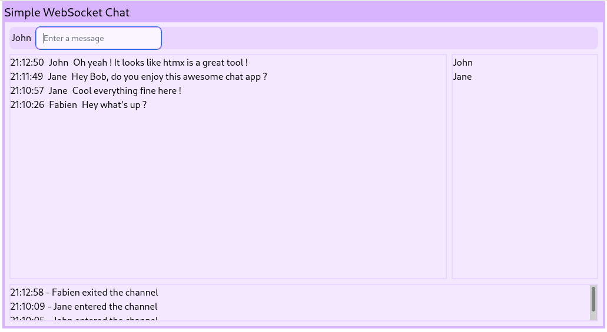

# sChat

schat is a basic WEB chat written in Haskell, HTMX and tailwindcss.
Its purpose is to be a playground around HTMX.



## Start sChat

```
nix run
firefox http://127.0.0.1:8091
```

## Hack on sChat

```Shell
nix develop
ghcid -W -c 'cabal repl' -r="Chat.runServer"
firefox http://127.0.0.1:8091
```

